# 🏆 Nations League Pool 2026/27

A prediction-pool app for the **UEFA Nations League 2026/27 (League A)** — the successor to [Pepijn's World Cup app](https://github.com/williamvz/pepijns-world-cup-prediction-app), rebuilt to be **maintenance-free**: match results, live scores, standings, top scorers and bonus questions all update automatically. Nobody has to type in a single result.

Runs as a **Home Assistant add-on** on a Raspberry Pi (or standalone with Docker). Mobile-first PWA in six languages (NL, EN, FR, ES, DE, IT).

## 📸 Screenshots

<table>
  <tr>
    <td align="center" width="33%">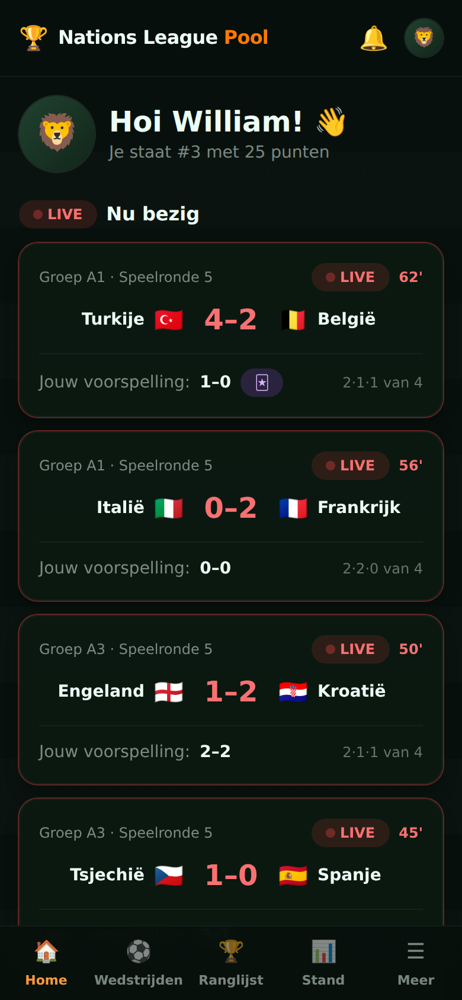<br><sub>Home: your rank, live matches and your predictions</sub></td>
    <td align="center" width="33%">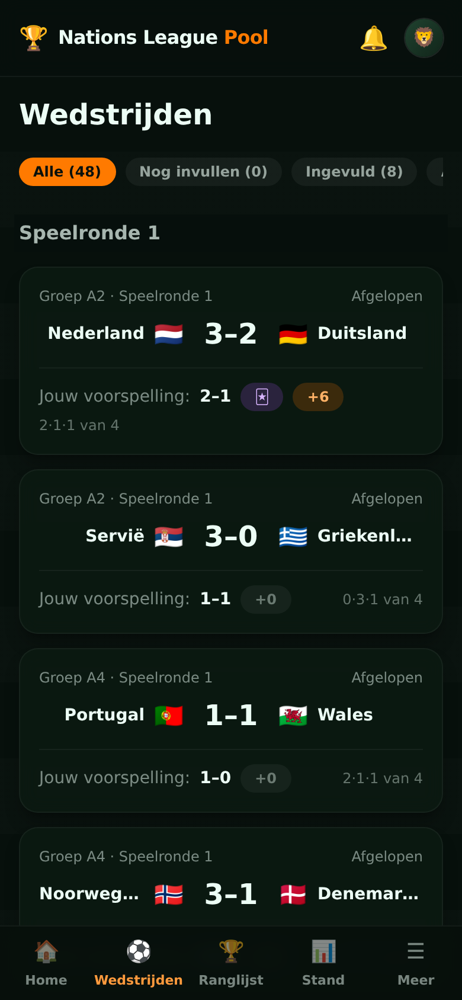<br><sub>Matches: live scores, points per prediction, the group's split</sub></td>
    <td align="center" width="33%">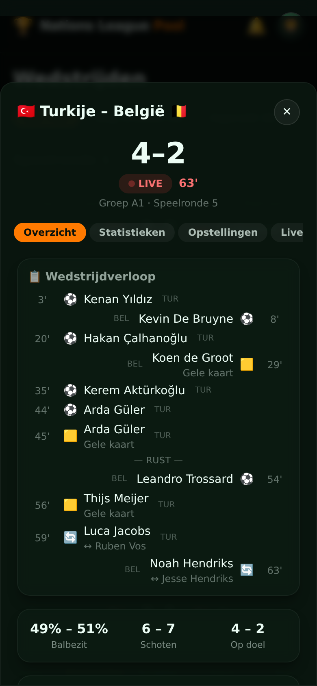<br><sub>Match centre: timeline with goals, cards and subs</sub></td>
  </tr>
  <tr>
    <td align="center" width="33%">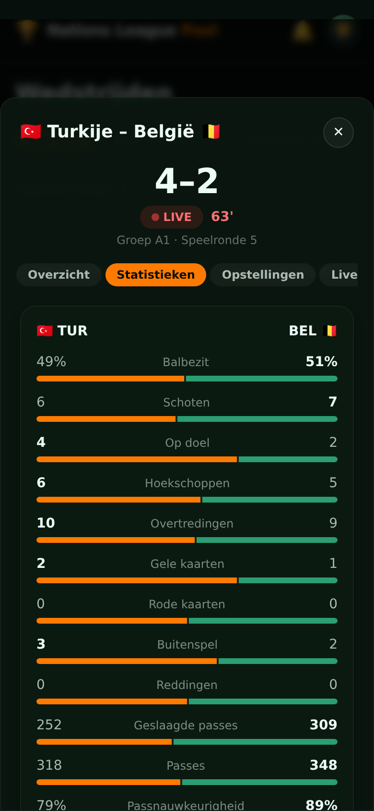<br><sub>Live team statistics</sub></td>
    <td align="center" width="33%">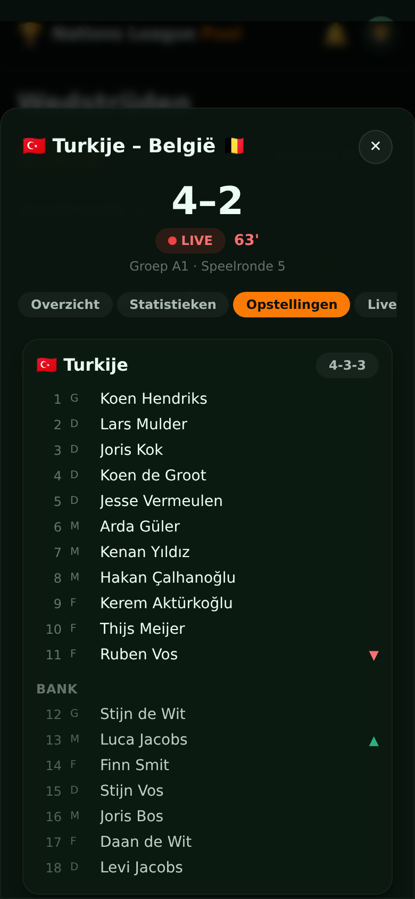<br><sub>Line-ups with formation and substitutions</sub></td>
    <td align="center" width="33%">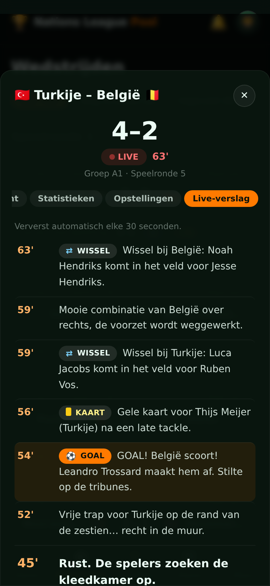<br><sub>Live commentary (translated to Dutch) with badges</sub></td>
  </tr>
  <tr>
    <td align="center" width="33%">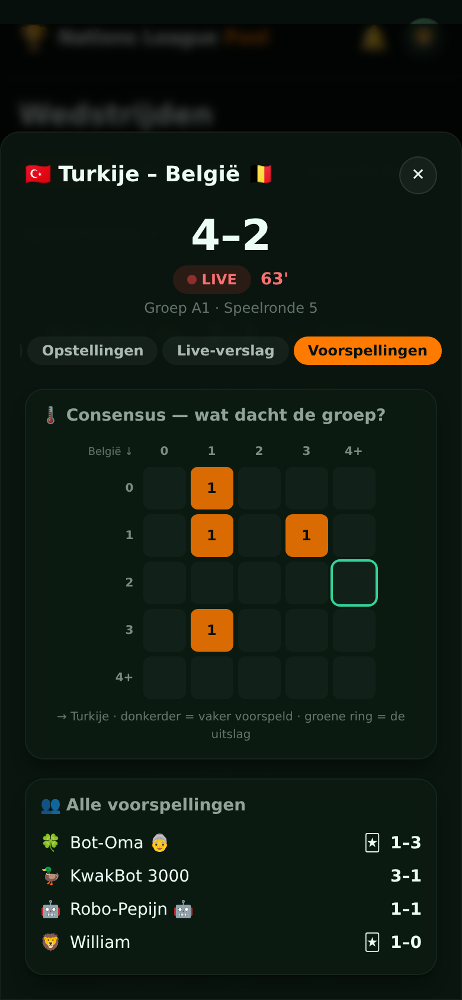<br><sub>Everyone's predictions and the consensus heatmap</sub></td>
    <td align="center" width="33%">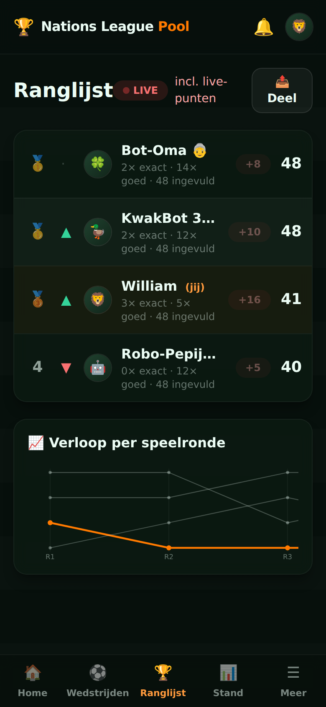<br><sub>Leaderboard with live points while matches are on</sub></td>
    <td align="center" width="33%">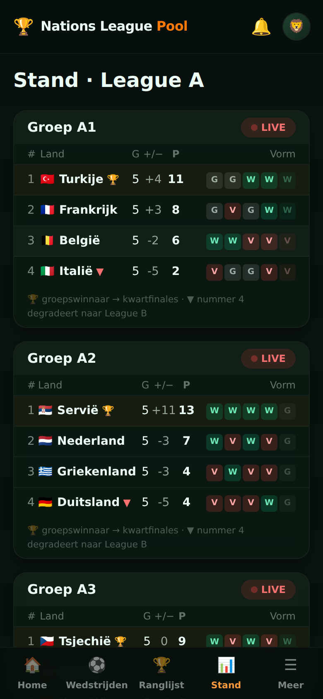<br><sub>Group tables and top scorers, updated automatically</sub></td>
  </tr>
  <tr>
    <td align="center" width="33%">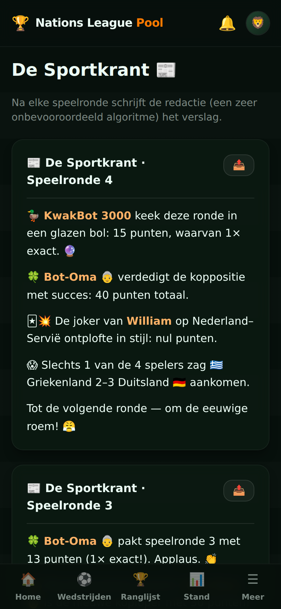<br><sub>De Sportkrant: an auto-written recap after every matchday</sub></td>
    <td align="center" width="33%">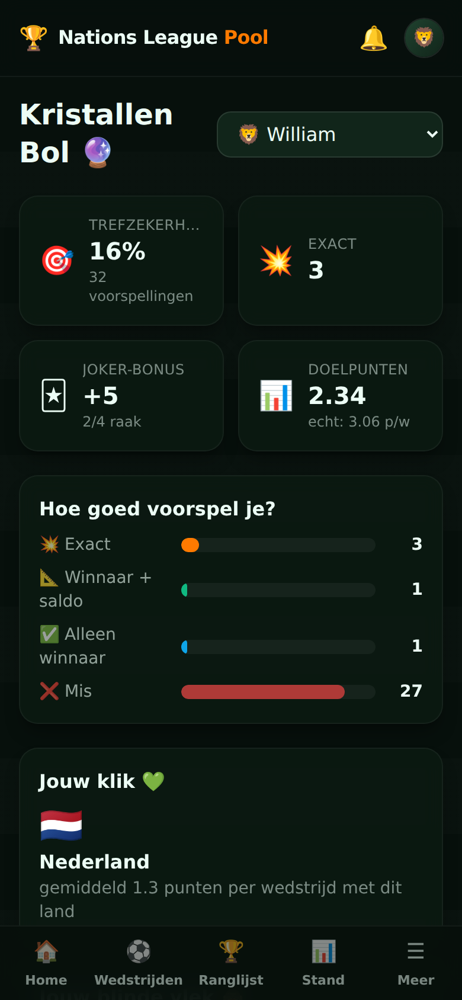<br><sub>Kristallen Bol: your personal prediction stats</sub></td>
    <td></td>
  </tr>
</table>

**TV mode:** a full-screen matchday dashboard for the living-room TV or a Home Assistant dashboard, with live scoreboards, the leaderboard reshuffling live, and one combined commentary feed of all matches with the flag of the team in action.

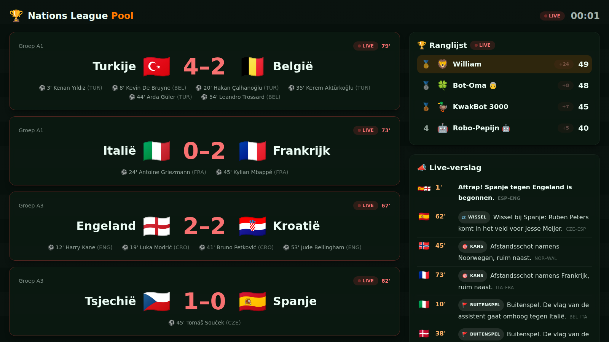

<sub>Screenshots come from demo mode (a simulated season) and are generated automatically: `cd nations-league-pool/e2e && npm run screenshots`.</sub>

## ✨ What's new compared to the World Cup app

| | WK Pool 2026 | Nations League Pool |
|---|---|---|
| Results entry | 100+ manual admin entries | **Fully automatic** (ESPN + TheSportsDB) |
| Live scores | ✗ | ✅ every 2 min during matches, live leaderboard |
| Match centre | ✗ | ✅ timeline, team stats, line-ups, live commentary and the written match report per match |
| Standings | internal only | ✅ live group tables with UEFA tie-breakers, form, insights |
| Top scorers | manual free-text bonus | ✅ synced per-goal, auto-resolved bonus question |
| Bonus grading | fragile string compare | ✅ automatic (standings/scorer based) |
| HA ingress | broken (absolute paths) | ✅ works — relative assets + hash routing |
| Timezones | countdowns drifted abroad | ✅ everything pinned to Europe/Amsterdam |
| Extra | — | 🃏 joker (×2, 1 per matchday), rank-history bump chart, head-to-head compare, community stats, 16 achievements (all actually attainable), open self-registration with in-app admin approval (invite code = skip the queue) |

## 🏠 Install on Home Assistant (Raspberry Pi 5)

> The add-on repository route requires this GitHub repo to be **public**. If you want to keep it private, use the local add-on route below.

**Route A — add-on repository (recommended):**

1. In Home Assistant: **Settings → Add-ons → Add-on Store → ⋮ → Repositories**
2. Add `https://github.com/williamvz/nations-league-predictor`
3. Install **Nations League Pool** (first build takes ~5–10 min on a Pi 5 — it compiles the frontend and SQLite bindings locally)
4. In the add-on **Configuration** tab set:
   - `jwt_secret` — long random string (`openssl rand -hex 32`)
   - `admin_password` — optional; auto-generated and printed in the log if empty
   - `invite_code` — optional; anyone can register (you approve them in-app), but this code skips the approval queue
5. **Start** → open **NL Pool** in the sidebar, or share `http://<pi-ip>:8099` with friends (Add to Home Screen = app experience)

**Route B — local add-on (private repo):**

Copy the `nations-league-pool/` folder to your Pi's `/addons` share (Samba add-on), then **Add-on Store → ⋮ → Check for updates**. It appears under *Local add-ons*.

Database lives at `/data/nlpool.db` inside the add-on → covered by normal HA backups.

## 🧪 Demo mode — test the whole system before September

Set `demo_mode: true` in the add-on config (or `DEMO_MODE=1` standalone) and restart: the app plays a **complete simulated season in ~1 hour** on a separate database (`nlpool-demo.db`) — live scores tick in, goals get scorers, standings update, the knockout bracket self-creates, bonus questions pay out and a champion is crowned, with 3 bot players keeping the leaderboard honest. Push/HA notifications fire for real, so you can verify your phone setup end to end. Flip it back off and the real database is exactly as you left it. A purple in-app banner marks demo state.

Demo mode also fills the match centre: every simulated match gets statistics, a timeline with cards and subs, line-ups, running commentary and a written (Dutch) report, all shaped exactly like the ESPN data.

ESPN's live commentary is English, machine-written from a fixed set of Opta sentence templates. For Dutch users `frontend/src/utils/commentaryNl.js` translates it with ordered pattern rules (team names included), so no external translation service is involved. Unknown sentences stay English, and a toggle shows the original.

The same simulation also runs headless in the test suite: `test/season.test.js` plays the full tournament through the sync engine and asserts points, standings, snapshots, scorers, bonus payouts, achievements and leaderboard consistency.

## 🐳 Standalone (without Home Assistant)

```bash
cp .env.example .env   # set JWT_SECRET (required) + ADMIN_PASSWORD
docker compose up -d --build
# → http://localhost:8099
```

## ⚙️ How the automation works

```
node-cron (in-process, Europe/Amsterdam)
├─ every 2 min   — only while a match is live or starts <30 min: live scores, minute, goals,
│                  match details (stats, timeline, commentary)
├─ every 20 min  — safety sweep: missed final results, line-ups (~1h before kickoff),
│                  match reports (retried up to 8h after the final whistle)
├─ daily 05:30   — fixture calendar sync (kickoff changes, postponements)
└─ at boot       — catch-up for everything missed while the Pi was off
```

- **Primary source:** ESPN public API — the scoreboard for scores, live minute and goal scorers; the per-match `summary` endpoint for team statistics, key events (cards, subs, VAR), line-ups, live commentary, venue/referee, head-to-head and the post-match recap. That payload is normalized into one JSON blob per match (`match_details` table) and served with `GET /api/matches/:id` as `details`. Every section is optional: ESPN often skips commentary or a recap for smaller matches, and the UI only shows the tabs it has data for.
- **Fallback:** TheSportsDB (scores + schedule)
- Team names are matched via normalized aliases (`Türkiye`/`Turkey`, `Czechia`/`Czech Republic`, …); provider match-IDs are remembered after first contact.
- When a match finishes: points are recalculated idempotently, users get a notification, the matchday is finalized (leaderboard snapshot → rank-movement achievements, day-winner announcement) and bonus questions resolve themselves (group winners, Netherlands points, top scorer).
- Every sync is logged; **Beheer → Status** shows health + a manual sync button. Manual results always win over providers.

## 📊 Scoring

| Prediction | Points |
|---|---|
| Exact score | **5** |
| Correct winner + goal difference | **3** |
| Correct winner (or draw) | **2** |
| 🃏 Joker (one per matchday) | **×2** |

Knockout multipliers: quarterfinal ×1.5, semifinal ×2, third place ×2, final ×2.5.

Bonus: group winners (4 × 5 pts), league-phase top scorer (5 pts), Netherlands' group-stage points total (5 pts, ±1 → 2 pts), and the Nations League champion (10 pts, resolved after the June 2027 final). **There are no prizes — you play for eternal glory only.**

The knockout rounds (quarterfinals March 2027, Final Four June 2027) are **created automatically** once the draw is made and the fixtures appear at the data providers; players get a notification that new matches are open for predictions. Penalty-shootout winners are captured automatically for matches level after 90 minutes.

## 🔔 Player notifications

- **Web push** (opt-in per device via Profiel): results, day winners, matchday reminders and last-call alerts for unfilled predictions. VAPID keys are auto-generated at first boot — zero configuration. Requires HTTPS (or the HA ingress URL).
- **Matchday reminders**: ~24h before each matchday (everyone) and ~3h before (only players with gaps). The admin also gets an HA summary of who hasn't filled in.
- **Share cards**: the leaderboard exports as a WhatsApp-ready image via the native share sheet (📤 button).

## 🧱 Stack & repo layout

```
repository.yaml            # HA add-on repository manifest
nations-league-pool/       # the add-on (= the whole app)
├─ config.yaml             # HA add-on config (ingress, ports, options)
├─ Dockerfile              # multi-stage: build frontend → slim runtime
├─ run.sh                  # reads HA options, starts server
├─ backend/                # Express + better-sqlite3 + node-cron
│  ├─ src/db/              # schema, seed (48 real fixtures), tournament data
│  ├─ src/routes/          # REST API (auth, predictions, leaderboard, …)
│  ├─ src/services/        # scoring, standings, achievements, bonus, notify
│  ├─ src/sync/            # providers (ESPN, TheSportsDB), matcher, scheduler
│  └─ test/                # node:test suite (unit, sync, full HTTP API)
├─ frontend/               # React 18 + Vite + Tailwind PWA (6 languages)
└─ e2e/                    # Playwright browser tests (demo-mode season)
```

Dev: `cd nations-league-pool/backend && npm i && JWT_SECRET=dev npm run dev`, then `cd ../frontend && npm i && npm run dev` (Vite proxies `/api`).

### 🧪 Testing

```bash
cd nations-league-pool
./test.sh            # everything: backend suite + frontend build + browser tests
./test.sh backend    # node:test only (~10 s): scoring, sync, ESPN parser, full HTTP API + frontend unit tests
./test.sh e2e        # Playwright only: builds the frontend, boots the app in demo mode, clicks through it
```

- `backend/test/api.test.js` walks the whole REST API over HTTP (register → approve → predict → result → leaderboard → admin).
- `frontend/src/utils/commentaryNl.test.js` pins the Dutch commentary translation against real ESPN lines.
- `backend/test/espn-summary.test.js` pins the ESPN match-detail parser against `test/fixtures/espn-summary.json`.
- `e2e/tests/*.spec.js` run in desktop and mobile Chrome. Failures leave a screenshot and trace in `e2e/test-results/` (`npx playwright show-trace …`).
- `npm run screenshots` (in `e2e/`) regenerates the README screenshots in `docs/screenshots/`: it plays a fast demo season with predictions, then photographs the main screens (~5 min).
- No Playwright browser downloaded? Point it at any Chromium: `PLAYWRIGHT_CHROMIUM=/usr/bin/chromium ./test.sh e2e`.

---

Gemaakt met ❤️ voor de pool · Hup Holland Hup! 🇳🇱
